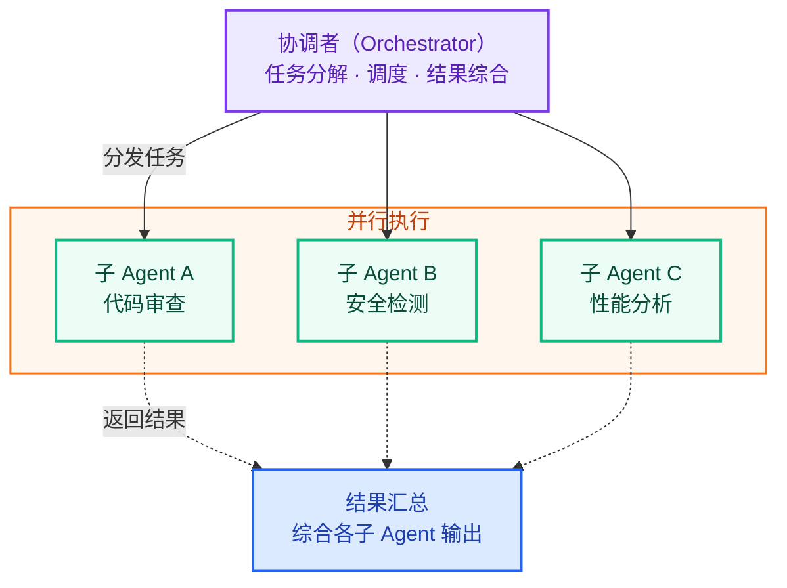

# Nocturne

> A quiet dark theme for focused Markdown writing, technical notes, and long-form reading.

Nocturne is designed around a deep violet-gray background, soft accent colors, and carefully balanced Markdown elements. It keeps everyday writing calm while making structure, code, tables, quotes, and highlights easy to scan.

---

## Writing Experience

A good Markdown theme should 'disappear' when you're writing, yet still keep your structure clear when you need it. **Nocturne emphasizes clarity** through readable spacing, calm colors, and a wider, GitHub-like writing area.

You can use it to write [technical documents](https://typora.io), personal knowledge bases, project notes, or long articles. It also supports ==highlighted text==, inline code like `nocturne.css`, superscripts x^2^, subscripts H~2~O, *italic text*, <u>underlines</u>, or ~~strikethroughs~~.

一个好的 Markdown 主题应该在你写作时“消失”，但在你需要时仍能让结构清晰可见。**Nocturne 强调清晰性**，通过可读的间距、平静的配色以及更宽的类似 GitHub 的写作区域实现这一点。

你可以用它来写 [技术文档](https://typora.io)、个人知识库、项目笔记或者长篇文章。它还支持 ==高亮文本==、像 `nocturne.css` 这样的行内代码、上标 x^2^ 和下标 H~2~O，*斜体字*，<u>下划线</u>，或者 ~~删除错误的文字~~。

还可以在需要添加脚注的文字后面+[+\^+序列+]，注释[^footnote]的产生可以鼠标放置其上单击自动产生，添加信息

[^footnote]: 这个就是"脚注"链接

### Design Goals

- Comfortable dark-mode reading
- Clear heading hierarchy
- Distinct code and inline styles
- Balanced contrast for long writing sessions
- Clean tables, quotes, and task lists

### Theme Checklist

- [x] Dark violet-gray palette
- [x] Source mode readability
- [x] Code block cursor visibility
- [x] Full table borders
- [x] System font stack
- [ ] More preview screenshots

# heading 标题

## 2标题 \#fff2bf 月光金有仪式感

### 3标题 \#64e0b3 极光绿

#### 4标题 \#ff7fa2 玫瑰红，有情绪但不脏

##### 5标题 \#c8a8ff 星云紫，保留主题身份

###### 6标题 \#b8a3bd 烟紫灰，收低层级

7没有标题

## Table 表格

| 优点           | 说明                                             |
| :------------- | :----------------------------------------------- |
| 舒适的深色阅读 | 深紫灰背景搭配柔和文字色，长时间写作不疲劳       |
| 清晰的层级结构 | 标题、引用、代码块区分明显，文档结构一目了然     |
| 精致的代码样式 | 行内代码使用暖色强调，代码块带深色面板与语法高亮 |
| 完整的表格边框 | 表格线条完整，表头与数据行对比适中，易于扫描     |

## Code Preview 代码块

Inline code uses a warm accent, while code blocks use a deeper panel background and syntax colors tuned for readability.

```python
from dataclasses import dataclass

@dataclass
class Theme:
    name: str
    background: str
    accent: str

theme = Theme(
    name="Nocturne",
    background="#211d25",
    accent="#b080ff",
)

def describe(theme: Theme) -> str:
    return f"{theme.name} is calm, readable, and quietly polished."

print(describe(theme))
```

## Math formula 数学式

支持两种数学公式的书写，示例：$\lim_{x\to\infty}\exp(-x)=0$.
$$
\Gamma(z) = \int_0^\infty t^{z-1}e^{-t}dt\,.
$$

## Mermaid 图表展示



