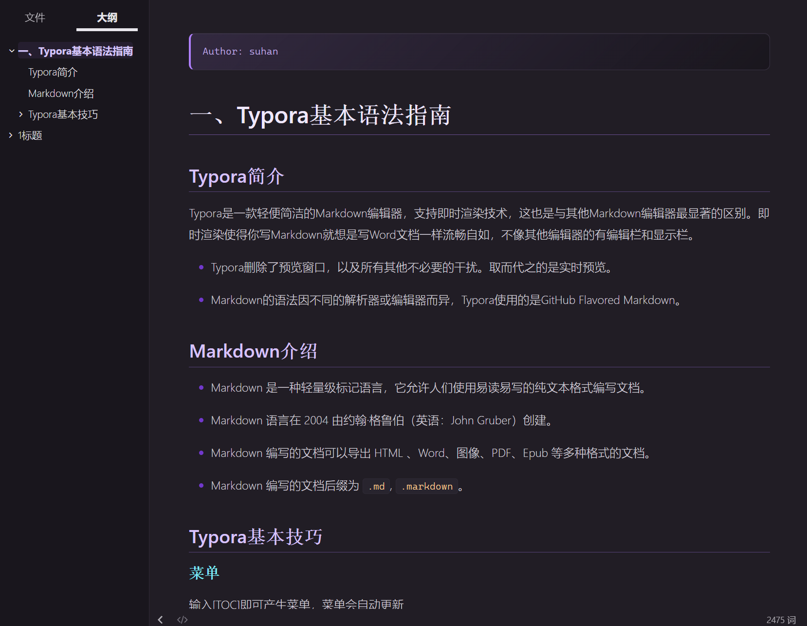
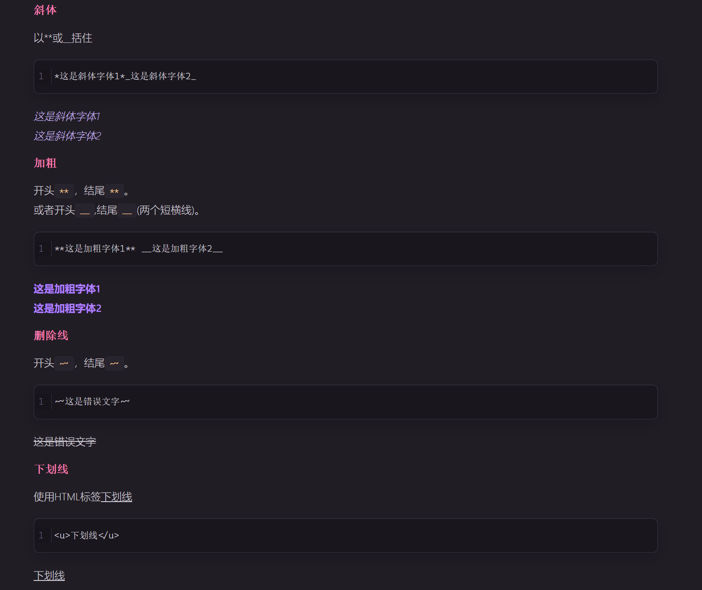
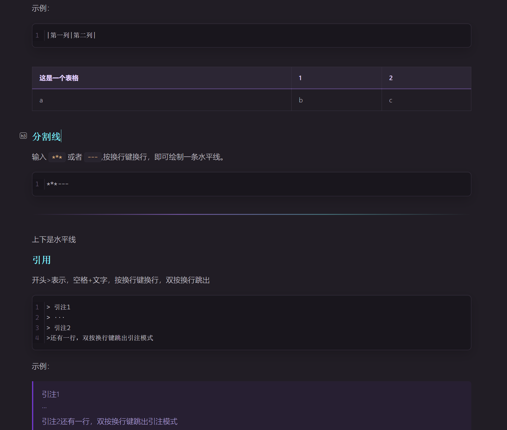

  English | <a href="README.zh-CN.md">中文</a>

# Typora Nocturne Theme

A single-file dark Typora theme inspired by the [Kiro IDE](https://kiro.dev) color palette.

Nocturne uses deep purple-gray backgrounds, soft violet accents, readable code styling, and carefully tuned Markdown elements for focused writing, technical notes, and long-form reading.

## Features

- Single CSS file installation
- Dark purple-gray palette inspired by Kiro IDE
- Wider GitHub-like writing area
- Clear heading hierarchy from `h1` to `h6`
- Improved code block readability and cursor visibility
- Carefully tuned text selection colors in editor, source mode, and code blocks
- Distinct styles for links, bold text, inline code, highlights, superscript, and subscript
- More readable tables with full cell borders
- Refined blockquotes, task lists, horizontal rules, and sidebar active states
- Better support for source mode, YAML blocks, raw HTML blocks, math blocks, and Mermaid diagrams
- System font stack by default, with no bundled font dependency

## Recommended For

- Markdown notes
- Programming documentation
- Knowledge bases
- Technical writing
- Long-form reading in dark mode

## Installation

1. Download `nocturne.css`.
2. Open Typora.
3. Go to `Preferences` → `Appearance` → `Open Theme Folder`.
4. Copy `nocturne.css` into the Typora theme directory.
5. Restart Typora.
6. Select **Nocturne** from the Themes menu.

## Fonts

This theme does not bundle custom fonts. It uses system fonts by default for better portability.

Recommended optional fonts:

- Body text: system UI fonts, Noto Sans CJK, Microsoft YaHei, PingFang SC
- Headings: system UI fonts, Noto Serif CJK SC, Source Han Serif SC, Songti SC
- Code: Cascadia Code, Fira Code, JetBrains Mono, Consolas, Menlo

## Screenshots

## Tested On

- Windows
- macOS

## Credits

Inspired by the visual style of [Kiro IDE](https://kiro.dev), with additional adjustments for Typora writing, reading, source editing, and Markdown preview workflows.
